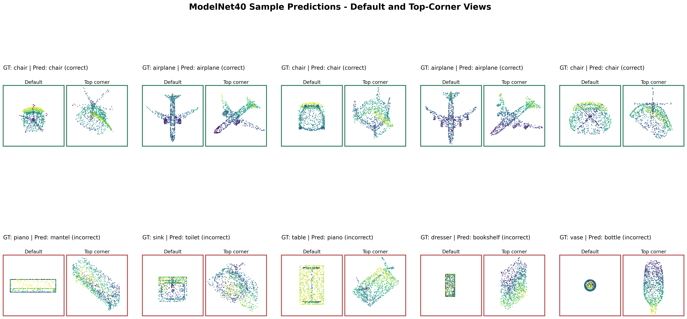
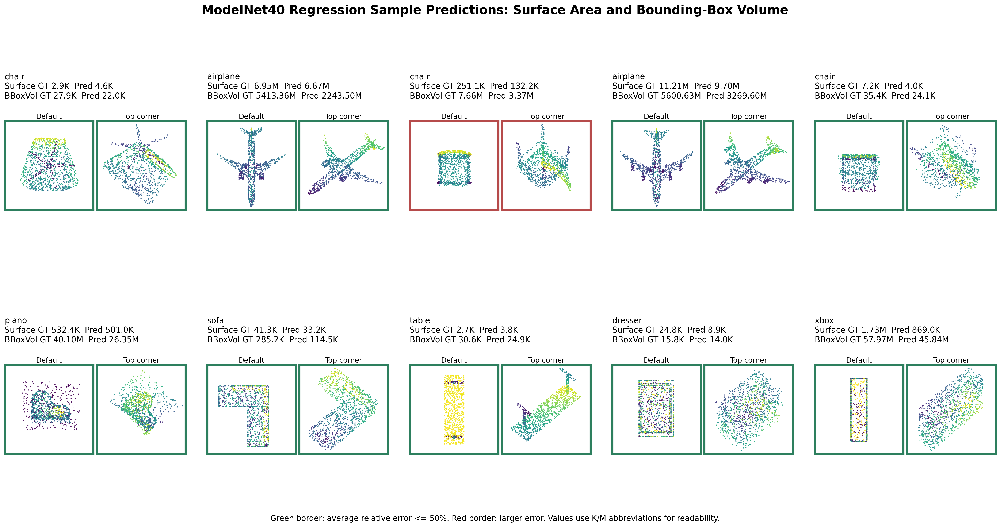

# Geometric Deep Learning Results

This repository contains 3D point-cloud experiments for ModelNet40. This README presents the ModelNet40 classification and regression results.

## ModelNet40 Classification

Dataset: ModelNet40  
Task: 40-class 3D object classification  
Input: 1024 sampled 3D points per object  
Model: PointNet++ MSG classifier  
Evaluation split: ModelNet40 test split

| Model | Dataset | Backend | Precision | Top-1 Test Accuracy | Top-5 Test Accuracy | Throughput |
|---|---|---|---|---:|---:|---:|
| PointNet++ MSG | ModelNet40 | PyTorch GPU | FP32 | 87.12% | 98.50% | 318.10 samples/sec |

The final evaluation was run on the VM with CUDA on an NVIDIA L4 GPU using the checkpoint at `checkpoints/cls/best.pth`. Full metrics, training curves, confusion matrix, and per-class accuracy are available in [reports/modelnet_classification/README.md](reports/modelnet_classification/README.md).

### Prediction Gallery



## ModelNet40 Regression

Dataset: ModelNet40  
Task: 3D geometric property regression for surface area and bounding-box volume  
Input: 1024 sampled 3D points per object  
Model: PointNet++ MSG regressor  
Evaluation split: ModelNet40 test split after robust target outlier removal

| Model | Dataset | Backend | Precision | Surface Area R2 | BBox Volume R2 | Mean R2 | Throughput |
|---|---|---|---|---:|---:|---:|---:|
| PointNet++ MSG | ModelNet40 | PyTorch GPU | FP32 | 0.5470 | 0.6232 | 0.5851 | 284.20 samples/sec |

The final evaluation was run on the VM with CUDA on an NVIDIA L4 GPU using the epoch-10 checkpoint at `checkpoints/modelnet_surface_bbox_reg/global/epoch_010.pth`. Full metrics, outlier analysis, and training details are available in [reports/modelnet_surface_bbox_regression/README.md](reports/modelnet_surface_bbox_regression/README.md).

### Prediction Gallery



## Reproducible Classification Commands

Run evaluation on the VM:

```bash
cd ~/geometric_deep_learning
source ~/miniconda3/etc/profile.d/conda.sh
conda activate gdl
python evaluate_classification.py \
  --run_dir ~/geometric_deep_learning \
  --data_dir ~/geometric_deep_learning/data \
  --batch_size 64 \
  --workers 4 \
  --warmup_batches 5 \
  --timed_batches 20
```

Generate the classification visualization assets:

```bash
python scripts/create_modelnet_classification_assets.py \
  --run_dir ~/geometric_deep_learning \
  --data_dir ~/geometric_deep_learning/data
```

## Reproducible Regression Commands

Run evaluation on the VM:

```bash
cd ~/geometric_deep_learning
source ~/miniconda3/etc/profile.d/conda.sh
conda activate gdl
python evaluate_modelnet_surface_bbox_regression.py \
  --run_dir ~/geometric_deep_learning \
  --data_dir ~/geometric_deep_learning/data/modelnet_surface_bbox \
  --checkpoint ~/geometric_deep_learning/checkpoints/modelnet_surface_bbox_reg/global/epoch_010.pth \
  --mode global \
  --batch_size 64 \
  --workers 4 \
  --warmup_batches 5 \
  --timed_batches 20
```

Generate the regression visualization assets:

```bash
python scripts/create_modelnet_regression_assets.py \
  --run_dir ~/geometric_deep_learning \
  --data_dir ~/geometric_deep_learning/data
```
