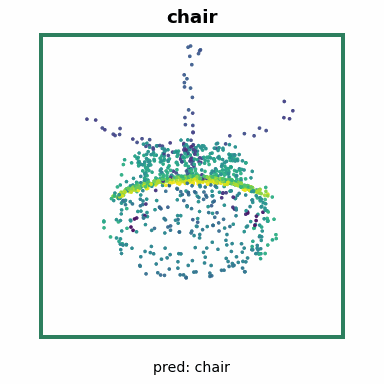
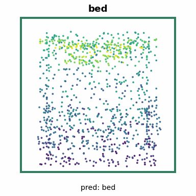

# Geometric Deep Learning Results

This repository contains 3D point-cloud experiments on ModelNet40 and
ShapeNetSem using PointNet++ MSG models.

The classification result is strong on ModelNet40, reaching 87.12% top-1 test
accuracy and 98.50% top-5 test accuracy. ModelNet40 regression also learns
useful geometric signal, but its R2 is more modest because these targets are
derived from mesh calculations and can inherit noise from mesh scale, topology,
and surface quality. ShapeNetSem is a curated, semantically enriched dataset
with physical-property annotations, so its labels are a better fit for the
physical-property tasks here; the ShapeNetSem geometry and weight experiments
reach mean test R2 values of 0.8820 and 0.8915.

## Results Summary

| Experiment | Dataset | Task | Model | Primary Result | Report |
|---|---|---|---|---:|---|
| ModelNet40 classification | ModelNet40 | 40-class object classification | PointNet++ MSG | 87.12% top-1 accuracy | [report](reports/modelnet40_classification/README.md) |
| ModelNet40 regression | ModelNet40 | surface area + bounding-box volume | PointNet++ MSG | 0.5851 mean R2 | [report](reports/modelnet40_regression/README.md) |
| ShapeNetSem geometry regression | ShapeNetSem | six physical/geometric targets | PointNet++ MSG | 0.8820 mean R2 | [report](reports/shapenetsem_regression/README.md) |
| ShapeNetSem weight regression | ShapeNetSem | weight from xyz + class + material priors | PointNet++ MSG + aux inputs | 0.8915 R2 | [report](reports/shapenetsem_weight/README.md) |

## ModelNet40 Classification

- Dataset: ModelNet40
- Task: 40-class 3D object classification
- Input: 1024 sampled 3D points per object
- Model: PointNet++ MSG classifier
- Evaluation split: ModelNet40 test split

| Model | Dataset | Backend | Precision | Top-1 Test Accuracy | Top-5 Test Accuracy | Throughput |
|---|---|---|---|---:|---:|---:|
| PointNet++ MSG | ModelNet40 | PyTorch GPU | FP32 | 87.12% | 98.50% | 318.10 samples/sec |

The final evaluation was run on the VM with CUDA on an NVIDIA L4 GPU using the
checkpoint at `artifacts/modelnet40_classification/checkpoints/best.pth`. Full metrics, training curves,
confusion matrix, and per-class accuracy are available in
[reports/modelnet40_classification/README.md](reports/modelnet40_classification/README.md).

### Prediction Samples

|   | Sample 1 | Sample 2 | Sample 3 | Sample 4 | Sample 5 |
| --- | --- | --- | --- | --- | --- |
| Sample |  |  |  |  |  |
| Prediction | GT `chair`<br>Pred `chair` | GT `airplane`<br>Pred `airplane` | GT `toilet`<br>Pred `toilet` | GT `bed`<br>Pred `bed` | GT `piano`<br>Pred `mantel` |

<details>
<summary><strong>ModelNet40 Regression</strong></summary>

## ModelNet40 Regression

- Dataset: ModelNet40
- Task: 3D geometric property regression for surface area and bounding-box volume
- Input: 1024 sampled 3D points per object
- Model: PointNet++ MSG regressor
- Evaluation split: ModelNet40 test split after robust target outlier removal

| Model | Dataset | Backend | Precision | Surface Area R2 | BBox Volume R2 | Mean R2 | Throughput |
|---|---|---|---|---:|---:|---:|---:|
| PointNet++ MSG | ModelNet40 | PyTorch GPU | FP32 | 0.5470 | 0.6232 | 0.5851 | 284.20 samples/sec |

The final evaluation was run on the VM with CUDA on an NVIDIA L4 GPU using the
epoch-10 checkpoint at
`artifacts/modelnet40_regression/checkpoints/global/epoch_010.pth`. Full metrics,
outlier analysis, and training details are available in
[reports/modelnet40_regression/README.md](reports/modelnet40_regression/README.md).

### Prediction Samples

|   | Sample 1 | Sample 2 | Sample 3 | Sample 4 | Sample 5 |
| --- | --- | --- | --- | --- | --- |
| Sample |  |  |  |  |  |
| Prediction | Surface `52.3K` vs `52.4K`<br>BBox vol `851.2K` vs `851.5K` | Surface `5.4K` vs `5.4K`<br>BBox vol `38.1K` vs `38.4K` | Surface `13.5K` vs `13.7K`<br>BBox vol `22.6K` vs `22.7K` | Surface `2.5K` vs `2.5K`<br>BBox vol `5.4K` vs `5.5K` | Surface `88.8K` vs `86.2K`<br>BBox vol `953.6K` vs `962.9K` |

</details>

## ShapeNetSem Geometry Regression

- Dataset: ShapeNetSem
- Task: regression for volume, support surface, and aligned dimensions
- Input: 1024 sampled 3D points per object
- Model: PointNet++ MSG regressor
- Evaluation split: ShapeNetSem 20% test split after robust target outlier removal

| Model | Dataset | Backend | Precision | Mean R2 | Strongest Target R2 | Weakest Target R2 | Throughput |
|---|---|---|---|---:|---:|---:|---:|
| PointNet++ MSG | ShapeNetSem | PyTorch GPU | FP32 | 0.8820 | 0.9399 aligned_dim_x | 0.7161 supportSurfaceArea | 252.70 samples/sec |

The final evaluation used the checkpoint at
`artifacts/shapenetsem_regression/checkpoints/global/best.pth`. Full target metrics,
outlier analysis, and training details are available in
[reports/shapenetsem_regression/README.md](reports/shapenetsem_regression/README.md).

### Prediction Samples

|   | Sample 1 | Sample 2 | Sample 3 | Sample 4 | Sample 5 |
| --- | --- | --- | --- | --- | --- |
| Sample |  |  |  |  |  |
| Solid volume | Pred `0.0696`<br>GT `0.0656` | Pred `0.0351`<br>GT `0.0379` | Pred `0.0238`<br>GT `0.0236` | Pred `0.0239`<br>GT `0.0240` | Pred `0.0627`<br>GT `0.0705` |
| Surface volume | Pred `0.0077`<br>GT `0.0074` | Pred `0.0130`<br>GT `0.0132` | Pred `0.0091`<br>GT `0.0093` | Pred `0.0102`<br>GT `0.0110` | Pred `0.0043`<br>GT `0.0047` |
| Support area | Pred `0.0110`<br>GT `0.0115` | Pred `0.0088`<br>GT `0.0097` | Pred `0.0635`<br>GT `0.0686` | Pred `0.0577`<br>GT `0.0613` | Pred `0.1300`<br>GT `0.1330` |
| Dim x | Pred `0.5723`<br>GT `0.6170` | Pred `0.6109`<br>GT `0.6117` | Pred `0.8564`<br>GT `0.8872` | Pred `0.6666`<br>GT `0.6450` | Pred `0.2415`<br>GT `0.2464` |
| Dim y | Pred `0.6218`<br>GT `0.6342` | Pred `0.9795`<br>GT `1.015` | Pred `0.6281`<br>GT `0.6415` | Pred `0.9564`<br>GT `0.9607` | Pred `0.5171`<br>GT `0.5315` |
| Dim z | Pred `0.6406`<br>GT `0.6410` | Pred `0.6182`<br>GT `0.6059` | Pred `0.1460`<br>GT `0.1325` | Pred `0.6835`<br>GT `0.7493` | Pred `0.5470`<br>GT `0.5422` |

## ShapeNetSem Weight Regression

- Dataset: ShapeNetSem
- Task: weight regression
- Input: 1024 sampled 3D points, class embedding, and material-property priors
- Model: PointNet++ MSG regressor with auxiliary inputs
- Evaluation split: ShapeNetSem 20% positive-weight test split

| Model | Dataset | Backend | Precision | Weight MAE | Weight RMSE | Weight R2 | Throughput |
|---|---|---|---|---:|---:|---:|---:|
| PointNet++ MSG + aux inputs | ShapeNetSem | PyTorch GPU | FP32 | 9.8237 | 22.8054 | 0.8915 | 246.44 samples/sec |

The final evaluation used the checkpoint at
`artifacts/shapenetsem_weight/checkpoints/auxiliary/best.pth`. Full metrics, material-prior
details, and training details are available in
[reports/shapenetsem_weight/README.md](reports/shapenetsem_weight/README.md).

### Prediction Samples

|   | Sample 1 | Sample 2 | Sample 3 | Sample 4 | Sample 5 |
| --- | --- | --- | --- | --- | --- |
| Sample |  |  |  |  |  |
| Weight | Pred `6.617` kg<br>GT `6.616` kg | Pred `6.846` kg<br>GT `6.842` kg | Pred `11.01` kg<br>GT `11.05` kg | Pred `15.42` kg<br>GT `15.48` kg | Pred `24.25` kg<br>GT `24.12` kg |

## Reproducible Commands

Run ModelNet40 classification evaluation:

```bash
cd ~/geometric_deep_learning
source ~/miniconda3/etc/profile.d/conda.sh
conda activate gdl
python -m experiments.modelnet40_classification.evaluate \
  --run_dir ~/geometric_deep_learning \
  --data_dir ~/geometric_deep_learning/data \
  --batch_size 64 \
  --workers 4 \
  --warmup_batches 5 \
  --timed_batches 20
```

Run ModelNet40 regression evaluation:

```bash
cd ~/geometric_deep_learning
source ~/miniconda3/etc/profile.d/conda.sh
conda activate gdl
python -m experiments.modelnet40_regression.evaluate \
  --run_dir ~/geometric_deep_learning \
  --data_dir ~/geometric_deep_learning/data/modelnet_surface_bbox \
  --checkpoint ~/geometric_deep_learning/artifacts/modelnet40_regression/checkpoints/global/epoch_010.pth \
  --mode global \
  --batch_size 64 \
  --workers 4 \
  --warmup_batches 5 \
  --timed_batches 20
```

Run ShapeNetSem geometry evaluation:

```bash
cd ~/geometric_deep_learning
source ~/miniconda3/etc/profile.d/conda.sh
conda activate gdl
python -m experiments.shapenetsem_regression.evaluate \
  --run_dir ~/geometric_deep_learning \
  --data_dir ~/shapenetsem_regression/data/shapenetsem_regression \
  --batch_size 64 \
  --workers 4 \
  --n_points 1024 \
  --warmup_batches 5 \
  --timed_batches 20
```

Run ShapeNetSem weight evaluation:

```bash
cd ~/geometric_deep_learning
source ~/miniconda3/etc/profile.d/conda.sh
conda activate gdl
python -m experiments.shapenetsem_weight.evaluate \
  --run_dir ~/geometric_deep_learning \
  --data_dir ~/shapenetsem_regression/data/shapenetsem_regression \
  --batch_size 64 \
  --workers 4 \
  --n_points 1024 \
  --warmup_batches 5 \
  --timed_batches 20
```

Generate rotating prediction GIF assets:

```bash
python tools/visuals/create_prediction_gif_assets.py \
  --run_dir ~/geometric_deep_learning \
  --data_dir ~/geometric_deep_learning/data \
  --artifact_root ~/geometric_deep_learning/artifacts
```

## Dataset Acknowledgements

ModelNet40 is from the ModelNet / 3D ShapeNets work. If using the ModelNet40
experiments, cite:

> Z. Wu, S. Song, A. Khosla, F. Yu, L. Zhang, X. Tang, and J. Xiao.
> 3D ShapeNets: A Deep Representation for Volumetric Shape Modeling.
> CVPR 2015.

ShapeNetSem is part of ShapeNet. If using the ShapeNetSem experiments, cite the
main ShapeNet report and the ShapeNetSem publication:

> A. X. Chang et al. ShapeNet: An Information-Rich 3D Model Repository.
> arXiv:1512.03012, 2015.

> M. Savva, A. X. Chang, and P. Hanrahan.
> Semantically-Enriched 3D Models for Common-sense Knowledge.
> CVPR 2015 Workshop on Functionality, Physics, Intentionality and Causality.

Raw datasets, processed point-cloud corpora, gated archives, and access tokens
are intentionally excluded from this repository. Model checkpoints are tracked
with Git LFS.
