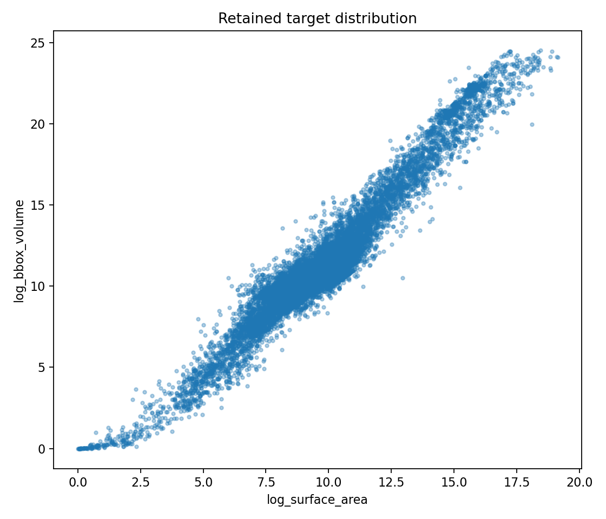
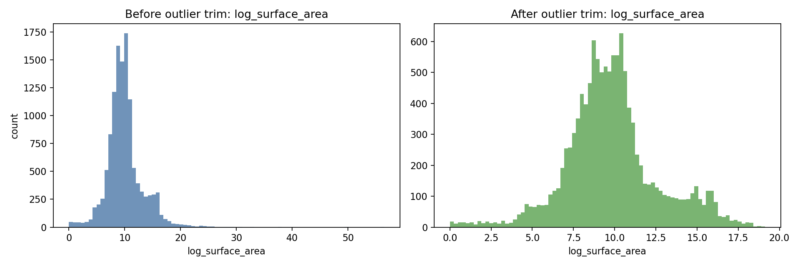
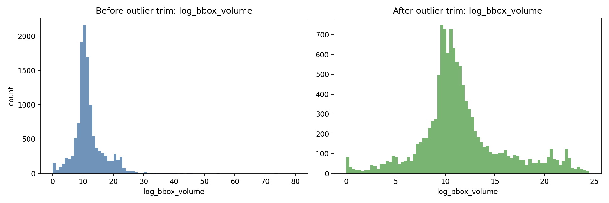
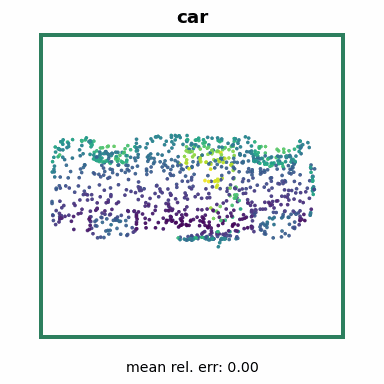
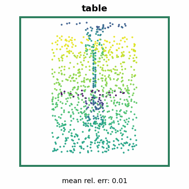
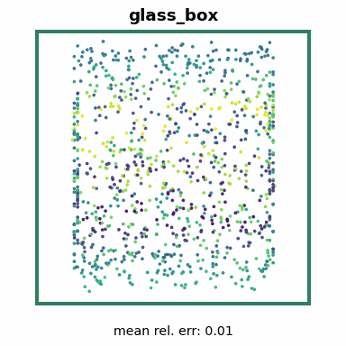
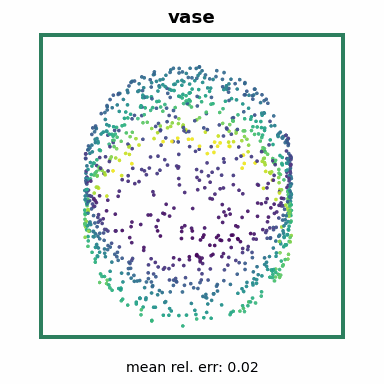
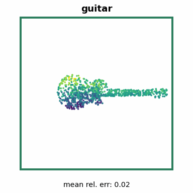

# ModelNet40 Surface Area + Bounding-Box Volume Regression Report

## 1. Experiment Goal

This experiment predicts two geometric properties from ModelNet40 point clouds:
`surface_area` and `bbox_volume`. It intentionally avoids watertight-mesh volume
targets, allowing nearly all usable ModelNet40 samples to participate.

## 2. Final Result

Final evaluated checkpoint:
`artifacts/modelnet40_regression/checkpoints/global/epoch_010.pth`

| Target | MAE | RMSE | R2 |
|---|---:|---:|---:|
| surface_area | 645,909.5625 | 5,873,480.5000 | 0.547017 |
| bbox_volume | 172,379,936.0000 | 1,310,032,768.0000 | 0.623208 |
| mean | 86,512,922.7813 | 657,953,124.2500 | 0.585112 |

| Runtime Metric | Value |
|---|---:|
| Throughput | 284.20 samples/sec |
| Latency | 3.5183 ms/sample |

Evaluation ran on PyTorch GPU FP32 with CUDA on an NVIDIA L4.

## 3. Dataset Flow

Each mesh is converted into 1024 sampled 3D surface points. Point clouds are
centered but not unit-sphere normalized per shape, so object scale remains
available to the model.

| Stage | Samples |
|---|---:|
| Usable ModelNet samples prepared | 12,311 |
| Removed by robust log-space target fences | 201 |
| Retained after trimming | 12,110 |

| Split | Samples |
|---|---:|
| Train | 7,747 |
| Validation | 1,930 |
| Test | 2,433 |

The dataset divides input coordinates by the train-derived median bounding-box
diagonal for numerical stability. Targets use train-only `log1p` normalization
statistics.

## 4. Target Analysis

Candidate target clusters were evaluated before training cluster-specific
regressors. The final decision was `global_model` because candidate clusters were
weak, overlapping, or too small after enforcing the 1,000-train-sample minimum.

Analysis artifacts:

| File | Contents |
|---|---|
| `artifacts/modelnet40_regression/data_metadata/analysis_summary.json` | Outlier and cluster decision summary |
| `artifacts/modelnet40_regression/data_metadata/outliers_removed.csv` | Samples removed by robust fences |
| `artifacts/modelnet40_regression/data_metadata/norm_stats.json` | Input and target normalization statistics |
| `artifacts/modelnet40_regression/data_metadata/splits.csv` | Final train/val/test manifest with retained cluster assignment |

### Target Scatter

### Target Distributions

## 5. Model And Training

The regressor is `PointNet2Regression(out_dim=2)`, sharing the PointNet++ MSG
backbone style used by the classifier and replacing the classification head with
a two-target regression head.

| Setting | Value |
|---|---|
| Optimizer | Adam |
| Batch size | 32 |
| Training duration | 10 epochs |
| Seed | 42 |
| Augmentation | z-axis rotation |
| Scheduler horizon | original 200-epoch cosine schedule |
| Model mode | global |

Final epoch-10 validation metrics:

| Target | MAE | R2 |
|---|---:|---:|
| surface_area | 392,758.0625 | 0.640000 |
| bbox_volume | 144,294,384.0000 | 0.857044 |
| mean R2 |  | 0.748522 |

## 6. Evaluation Artifacts

| File | Contents |
|---|---|
| `artifacts/modelnet40_regression/results/global/reg_test_results.txt` | Human-readable test metrics |
| `artifacts/modelnet40_regression/results/global/reg_predictions.csv` | Sample-level true and predicted targets |
| `artifacts/modelnet40_regression/logs/global/train_log.csv` | Epoch-level training and validation history |
| `artifacts/modelnet40_regression/checkpoints/global/epoch_010.pth` | Final evaluated model checkpoint |

## 7. Visual Summary

|   | Sample 1 | Sample 2 | Sample 3 | Sample 4 | Sample 5 |
| --- | --- | --- | --- | --- | --- |
| Sample |  |  |  |  |  |
| Prediction | Surface `52.3K` vs `52.4K` BBox vol `851.2K` vs `851.5K` | Surface `5.4K` vs `5.4K` BBox vol `38.1K` vs `38.4K` | Surface `13.5K` vs `13.7K` BBox vol `22.6K` vs `22.7K` | Surface `2.5K` vs `2.5K` BBox vol `5.4K` vs `5.5K` | Surface `88.8K` vs `86.2K` BBox vol `953.6K` vs `962.9K` |

## 8. Interpretation

The final global model achieves positive test R2 on both targets. Bounding-box
volume is easier than surface area because it depends more directly on coarse
spatial extent, while surface area is more sensitive to local mesh detail and
sampling ambiguity.
