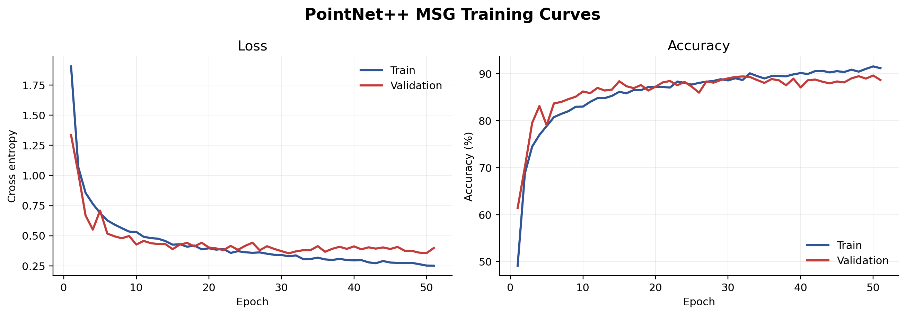
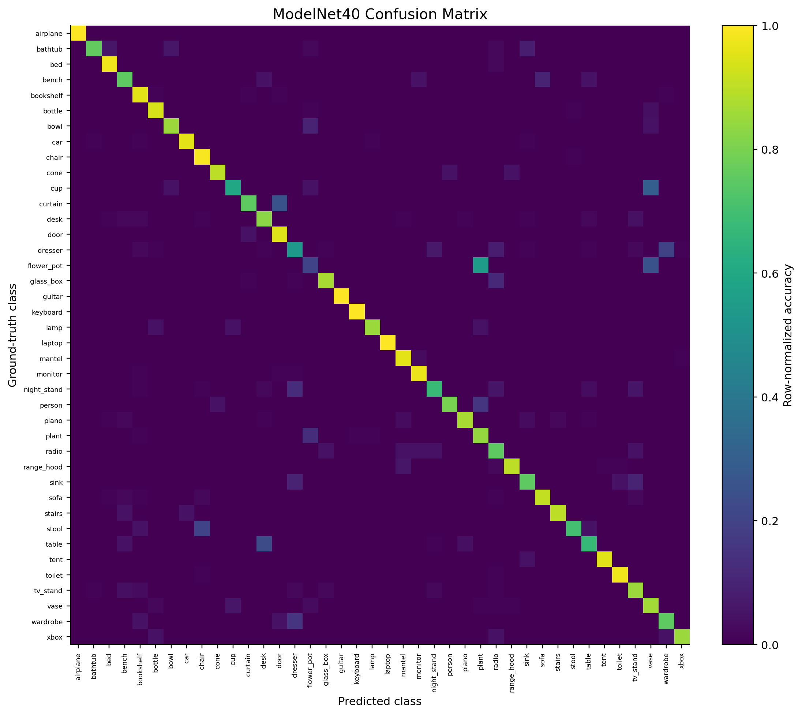
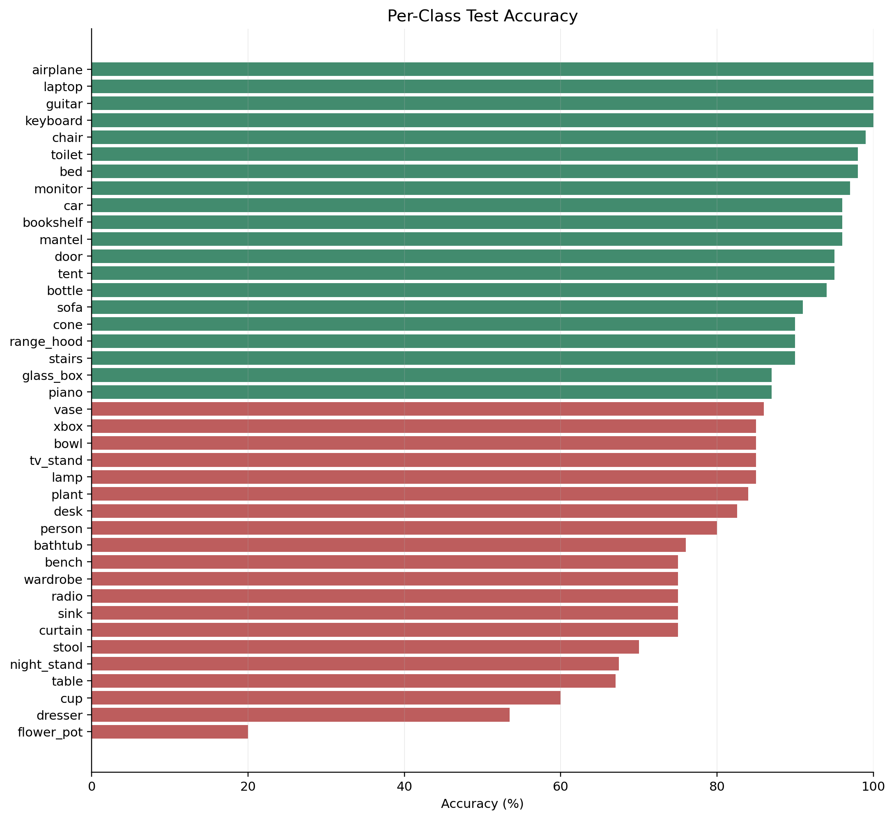
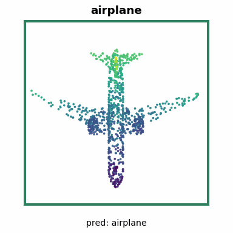
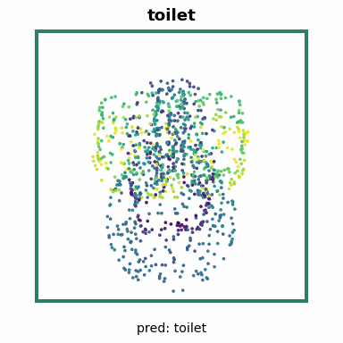
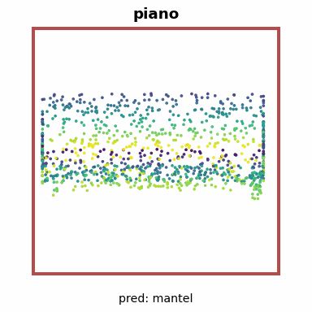

# ModelNet40 Classification Report

## 1. Experiment Goal

This experiment evaluates a PointNet++ multi-scale grouping classifier on the
ModelNet40 40-class object classification benchmark. Each mesh is represented as
1024 sampled 3D surface points.

## 2. Final Result

Final checkpoint: `checkpoints/cls/best.pth`

| Metric | Value |
|---|---:|
| Top-1 test accuracy | 87.1151% |
| Top-5 test accuracy | 98.5008% |
| Mean class accuracy | 84.0122% |
| Throughput | 318.10 samples/sec |
| Latency | 3.1436 ms/sample |
| Timed samples | 1280 |
| Timed duration | 4.0239 sec |

Evaluation ran on PyTorch GPU FP32 with CUDA on an NVIDIA L4.

## 3. Dataset Flow

ModelNet40 meshes are converted into point-cloud `.npz` files with 1024 sampled
surface points per object. Point clouds are centered and normalized to the unit
sphere for classification.

| Split | Samples |
|---|---:|
| Train | 7874 |
| Validation | 1969 |
| Test | 2468 |

The validation split is a stratified 20% carve-out from the native ModelNet40
training split. The test split is the native ModelNet40 test split.

## 4. Model And Training

The classifier is `PointNet2Classification`, a PointNet++ MSG model with
1,743,400 trainable parameters.

| Stage | Configuration | Output |
|---|---|---:|
| SA1 MSG | ratio 0.5, radii 0.1/0.2/0.4 | 320 features |
| SA2 MSG | ratio 0.25, radii 0.2/0.4/0.8 | 640 features |
| Global SA | MLP `[643,256,512,1024]` with global max-pooling | 1024 features |
| Head | Linear 1024 -> 512 -> 256 -> 40 with batch norm, ReLU, dropout 0.4 | 40 logits |

| Setting | Value |
|---|---|
| Optimizer | Adam |
| Learning rate | 1e-3 |
| Weight decay | 1e-4 |
| Scheduler | CosineAnnealingLR, eta_min 1e-5 |
| Batch size | 32 |
| Maximum epochs | 250 |
| Completed epochs | 51 |
| Early stopping | patience 20, selected by validation loss |
| Best checkpoint epoch | 31 |
| Best validation loss | 0.353710 |
| Peak validation accuracy | 89.6394% at epoch 50 |
| Augmentation | random scale, z-axis rotation, jitter |

The checkpoint was selected by lowest validation loss. Top-5 accuracy is computed
directly from model logits with `torch.topk`.

## 5. Evaluation Artifacts

| File | Contents |
|---|---|
| `results/cls_test_results.txt` | Human-readable test metrics |
| `results/cls_metrics.json` | Metrics and runtime metadata |
| `results/cls_per_class_acc.csv` | Per-class test accuracy |
| `results/cls_confusion_matrix.csv` | 40 x 40 confusion matrix |
| `results/cls_sample_predictions.csv` | Sample-level labels, predictions, confidence, and top-5 classes |
| `logs/cls_train_log.csv` | Epoch-level training and validation history |

## 6. Visual Summary

### Training Curves

### Confusion Matrix

### Per-Class Accuracy

### Prediction Samples

|   | Sample 1 | Sample 2 | Sample 3 | Sample 4 | Sample 5 |
| --- | --- | --- | --- | --- | --- |
| Sample |  |  |  |  |  |
| Prediction | GT `chair` Pred `chair` | GT `airplane` Pred `airplane` | GT `toilet` Pred `toilet` | GT `bed` Pred `bed` | GT `piano` Pred `mantel` |

## 7. Error Analysis

Highest per-class accuracies:

| Class | Accuracy |
|---|---:|
| airplane | 100.00% |
| guitar | 100.00% |
| keyboard | 100.00% |
| laptop | 100.00% |
| chair | 99.00% |
| bed | 98.00% |
| toilet | 98.00% |
| monitor | 97.00% |

Lowest per-class accuracies:

| Class | Accuracy |
|---|---:|
| flower_pot | 20.00% |
| dresser | 53.49% |
| cup | 60.00% |
| table | 67.00% |
| night_stand | 67.44% |
| stool | 70.00% |
| bench | 75.00% |
| curtain | 75.00% |

Most frequent confusion pairs:

| Ground Truth | Predicted | Count |
|---|---|---:|
| table | desk | 23 |
| dresser | wardrobe | 17 |
| plant | flower_pot | 13 |
| flower_pot | plant | 11 |
| glass_box | radio | 11 |
| night_stand | dresser | 11 |
| dresser | radio | 7 |
| cup | vase | 6 |
| dresser | night_stand | 6 |
| range_hood | mantel | 6 |

The model is strongest on categories with distinctive global silhouettes. Errors
cluster around visually adjacent or fine-detail-dependent classes such as
flower pot versus plant, table versus desk, and box-like furniture categories.
