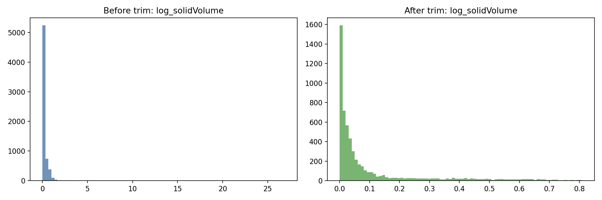
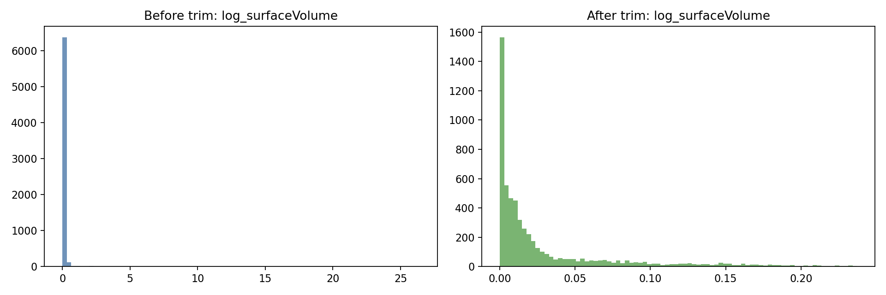
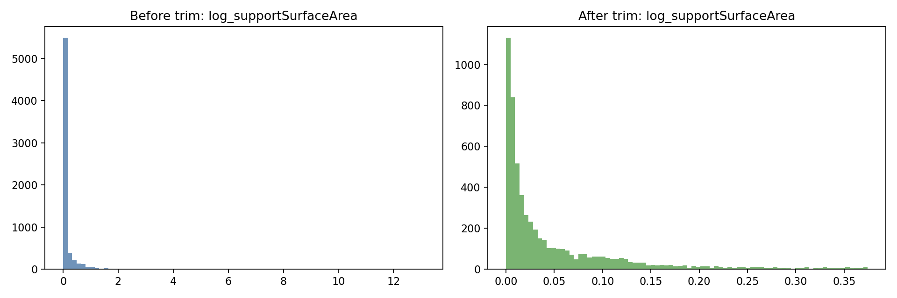
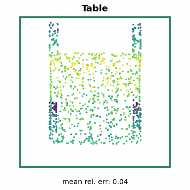
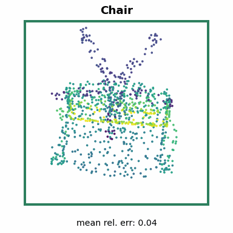
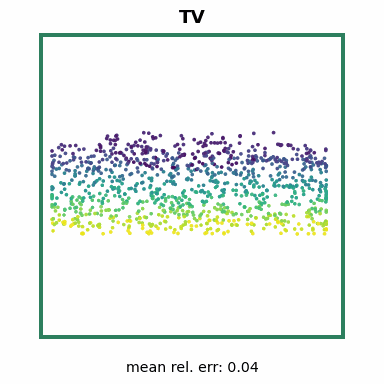
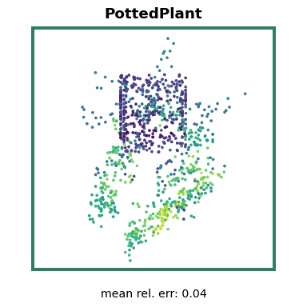
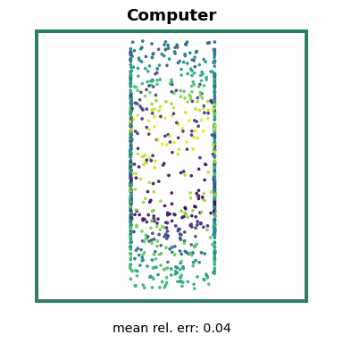

# ShapeNetSem Geometry Regression Report

## 1. Experiment Goal

This experiment predicts six ShapeNetSem physical and geometric properties from
1024-point surface samples:
`solidVolume`, `surfaceVolume`, `supportSurfaceArea`, `aligned_dim_x`,
`aligned_dim_y`, and `aligned_dim_z`.

ShapeNetSem is a curated, semantically enriched subset of ShapeNet. That makes
it a stronger fit for physical-property regression than computed-only targets
from generic mesh collections, where labels can inherit mesh-quality and
measurement noise.

## 2. Final Result

Final checkpoint: `artifacts/shapenetsem_regression/checkpoints/global/best.pth`

| Target | MAE | RMSE | R2 |
|---|---:|---:|---:|
| solidVolume | 0.023979 | 0.056935 | 0.938695 |
| surfaceVolume | 0.005797 | 0.013314 | 0.922843 |
| supportSurfaceArea | 0.019840 | 0.043503 | 0.716097 |
| aligned_dim_x | 0.076202 | 0.130849 | 0.939858 |
| aligned_dim_y | 0.047422 | 0.123989 | 0.922957 |
| aligned_dim_z | 0.068807 | 0.148185 | 0.851625 |
| mean | 0.040341 | 0.086129 | 0.882012 |

| Runtime Metric | Value |
|---|---:|
| Throughput | 252.70 samples/sec |
| Latency | 3.9576 ms/sample |
| Test samples | 1,139 |

Evaluation ran on PyTorch GPU FP32 with CUDA on an NVIDIA L4.

## 3. Dataset Flow

ShapeNetSem OBJ meshes were converted into 1024 sampled surface points per
object. Point clouds are centered and preserve metric scale, then are divided by
a train-derived median aligned-bounding-box diagonal for numerical stability.
Targets use train-only `log1p` z-score normalization.

| Stage | Samples |
|---|---:|
| Usable ShapeNetSem samples prepared | 6,548 |
| Removed by robust log-space target fences | 829 |
| Retained after trimming | 5,719 |

| Split | Samples |
|---|---:|
| Train | 3,436 |
| Validation | 1,144 |
| Test | 1,139 |

## 4. Target Analysis

The prepared metadata uses current ShapeNetSem metadata from ShapeNet Solr. A
unit correction converts `aligned.dims` values from centimeters into meters,
matching the metric-scaled meshes used for point sampling.

Analysis artifacts:

| File | Contents |
|---|---|
| `artifacts/shapenetsem_regression/data_metadata/analysis_summary.json` | Outlier and split summary |
| `artifacts/shapenetsem_regression/data_metadata/outliers_removed.csv` | Samples removed by robust fences |
| `artifacts/shapenetsem_regression/data_metadata/norm_stats.json` | Input and target normalization statistics |
| `artifacts/shapenetsem_regression/data_metadata/splits.csv` | Final train/val/test manifest |

### Target Distributions

## 5. Model And Training

The regressor is `PointNet2Regression(out_dim=6)`, using the same PointNet++ MSG
backbone family as the ModelNet experiments and a six-target regression head.

| Setting | Value |
|---|---|
| Optimizer | Adam |
| Learning rate | 3e-4 |
| Weight decay | 1e-4 |
| Batch size | 32 |
| Maximum epochs | 200 |
| Completed epochs | 200 |
| Early stopping | patience 30, selected by validation Huber loss |
| Best checkpoint epoch | 178 |
| Best validation Huber loss | 0.034276 |
| Loss | SmoothL1Loss / Huber beta 1.0 |
| Augmentation | z-axis rotation |

## 6. Evaluation Artifacts

| File | Contents |
|---|---|
| `artifacts/shapenetsem_regression/results/global/reg_test_results.txt` | Human-readable test metrics |
| `artifacts/shapenetsem_regression/results/global/metrics.json` | Metrics and runtime metadata |
| `artifacts/shapenetsem_regression/results/global/reg_predictions.csv` | Sample-level true and predicted targets |
| `artifacts/shapenetsem_regression/logs/global/train_log.csv` | Epoch-level training and validation history |
| `artifacts/shapenetsem_regression/checkpoints/global/best.pth` | Best model checkpoint |

## 7. Visual Summary

|   | Sample 1 | Sample 2 | Sample 3 | Sample 4 | Sample 5 |
| --- | --- | --- | --- | --- | --- |
| Sample |  |  |  |  |  |
| Solid volume | Pred `0.0696` GT `0.0656` | Pred `0.0351` GT `0.0379` | Pred `0.0238` GT `0.0236` | Pred `0.0239` GT `0.0240` | Pred `0.0627` GT `0.0705` |
| Surface volume | Pred `0.0077` GT `0.0074` | Pred `0.0130` GT `0.0132` | Pred `0.0091` GT `0.0093` | Pred `0.0102` GT `0.0110` | Pred `0.0043` GT `0.0047` |
| Support area | Pred `0.0110` GT `0.0115` | Pred `0.0088` GT `0.0097` | Pred `0.0635` GT `0.0686` | Pred `0.0577` GT `0.0613` | Pred `0.1300` GT `0.1330` |
| Dim x | Pred `0.5723` GT `0.6170` | Pred `0.6109` GT `0.6117` | Pred `0.8564` GT `0.8872` | Pred `0.6666` GT `0.6450` | Pred `0.2415` GT `0.2464` |
| Dim y | Pred `0.6218` GT `0.6342` | Pred `0.9795` GT `1.015` | Pred `0.6281` GT `0.6415` | Pred `0.9564` GT `0.9607` | Pred `0.5171` GT `0.5315` |
| Dim z | Pred `0.6406` GT `0.6410` | Pred `0.6182` GT `0.6059` | Pred `0.1460` GT `0.1325` | Pred `0.6835` GT `0.7493` | Pred `0.5470` GT `0.5422` |

## 8. Interpretation

The model achieves strong overall geometric regression performance, with mean
test R2 of 0.8820. The dimensional and volume targets are especially strong.
`supportSurfaceArea` is weaker than the other targets, likely because support
area depends on local contact geometry and semantic orientation conventions more
than on coarse object extent alone.
