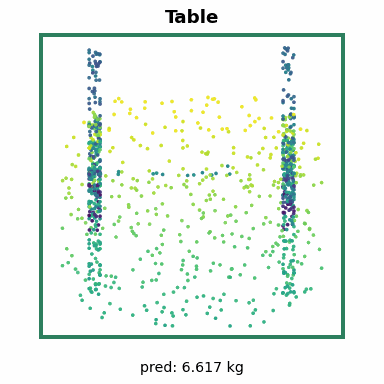
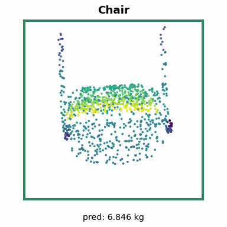
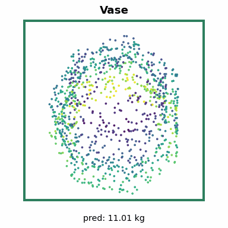
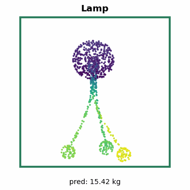
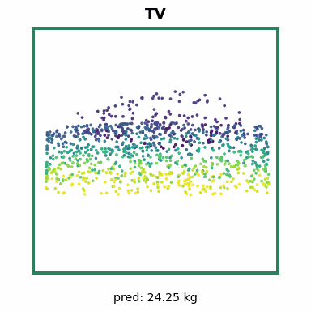

# ShapeNetSem Weight Regression Report

## 1. Experiment Goal

This supplemental experiment predicts ShapeNetSem object `weight` from a point
cloud plus side information:

- 1024 sampled xyz points
- ShapeNetSem class embedding
- material-property priors from ShapeNetSem material and density tables

`staticFrictionForce` is intentionally excluded because it can encode weight
through physical relationships and would risk target leakage.

## 2. Final Result

Final checkpoint: `checkpoints/shapenetsem_weight/auxiliary/best.pth`

| Target | MAE | RMSE | R2 |
|---|---:|---:|---:|
| weight | 9.823737 | 22.805380 | 0.891521 |

| Runtime Metric | Value |
|---|---:|
| Throughput | 246.44 samples/sec |
| Latency | 4.0577 ms/sample |
| Test samples | 824 |

Evaluation ran on PyTorch GPU FP32 with CUDA on an NVIDIA L4.

## 3. Dataset Flow

Only samples with positive ShapeNetSem weight annotations are retained. Point
clouds are centered, keep metric scale, and are divided by a train-derived input
scale for numerical stability. Weight uses train-only `log1p` z-score
normalization.

| Stage | Samples |
|---|---:|
| Positive-weight retained samples | 4,125 |
| Samples with material priors | 4,101 |

| Split | Samples |
|---|---:|
| Train | 2,480 |
| Validation | 821 |
| Test | 824 |

The auxiliary feature vector has 22 dimensions: 19 material ratios, material
density mean, material friction coefficient mean, and a `has_material_prior`
indicator.

## 4. Model And Training

The model is `PointNet2AuxRegression`, a PointNet++ MSG point-cloud backbone with
class and auxiliary-material inputs fused into the regression head.

| Setting | Value |
|---|---|
| Optimizer | Adam |
| Learning rate | 3e-4 |
| Weight decay | 1e-4 |
| Batch size | 32 |
| Maximum epochs | 120 |
| Completed epochs | 73 |
| Early stopping | patience 20, selected by validation Huber loss |
| Best checkpoint epoch | 53 |
| Best validation Huber loss | 0.020121 |
| Loss | SmoothL1Loss / Huber beta 1.0 |
| Augmentation | z-axis rotation |

## 5. Evaluation Artifacts

| File | Contents |
|---|---|
| `results/shapenetsem_weight/auxiliary/weight_test_results.txt` | Human-readable test metrics |
| `results/shapenetsem_weight/auxiliary/metrics.json` | Metrics and runtime metadata |
| `results/shapenetsem_weight/auxiliary/weight_predictions.csv` | Sample-level true and predicted weight |
| `logs/shapenetsem_weight/auxiliary/train_log.csv` | Epoch-level training and validation history |
| `checkpoints/shapenetsem_weight/auxiliary/best.pth` | Best model checkpoint |
| `data/shapenetsem_regression/weight_norm_stats.json` | Target, input, class, and auxiliary normalization statistics |

## 6. Visual Summary

|   | Sample 1 | Sample 2 | Sample 3 | Sample 4 | Sample 5 |
| --- | --- | --- | --- | --- | --- |
| Sample |  |  |  |  |  |
| Weight | Pred `6.617` kg GT `6.616` kg | Pred `6.846` kg GT `6.842` kg | Pred `11.01` kg GT `11.05` kg | Pred `15.42` kg GT `15.48` kg | Pred `24.25` kg GT `24.12` kg |

## 7. Interpretation

The supplemental model reaches 0.8915 test R2 on weight prediction. The strong
result is consistent with ShapeNetSem's curated physical annotations and the
extra conditioning from class and material priors. Because material priors are
category-level rather than true per-object material observations, they should be
treated as useful context rather than direct instance evidence.
